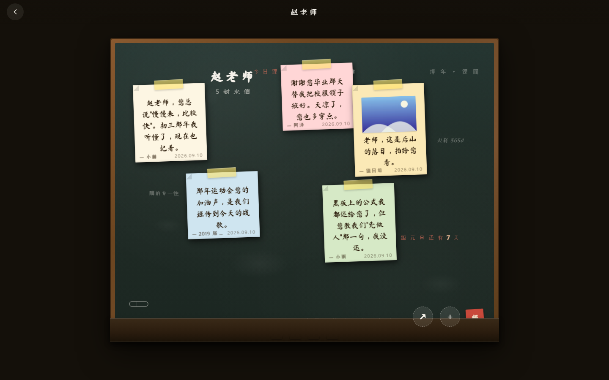
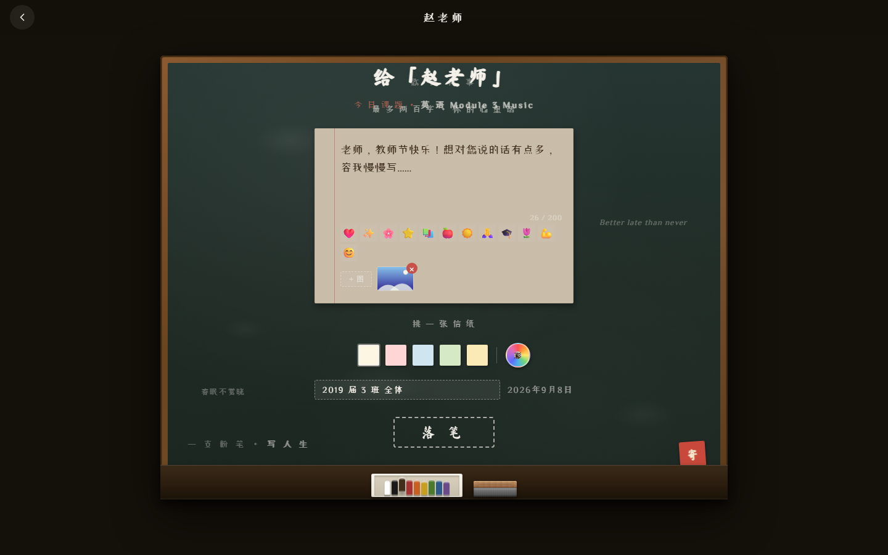
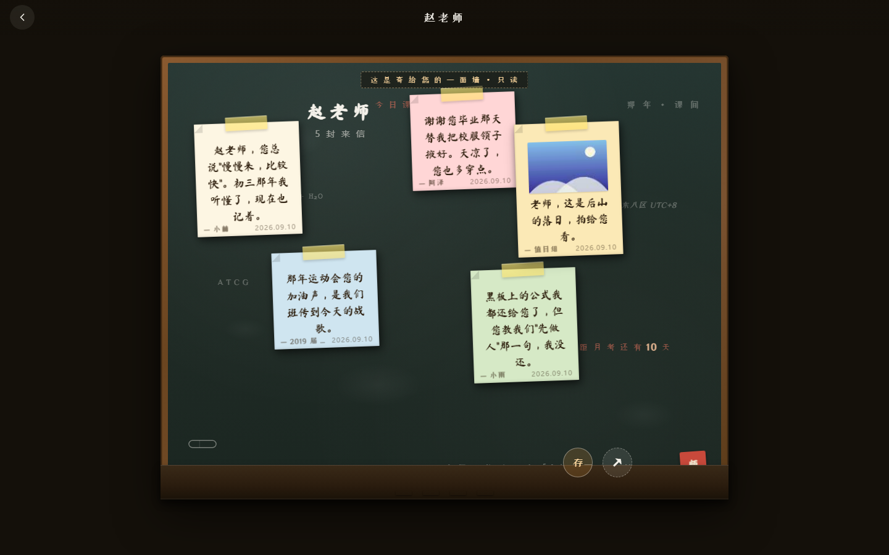
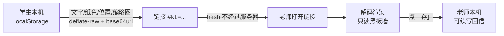

<div align="center">

# 黑板 · 上的话

**Unfading Wall —— 把想对老师说的话，贴上 TA 的黑板墙**

教师节 Vibe Coding 挑战参赛作品 · 纯前端 · 零后端 · 零注册

[](./LICENSE)
[](#-快速开始)
[](#-技术栈)
[](#-技术栈)

</div>

> 板书会被擦掉，粉笔灰会落定，但学生写在墙上的话不会褪色——这就是 **unfading wall**。



---

## ✨ 它是什么

每个学生写下对老师的一句话（≤200 字），挑一张彩色信纸、一支"粉笔"，这张便签就会
出现在老师的**黑板墙**上——像被胶带贴在真黑板上一样，可以**拖动**换位置、**单击**
看全文、**双击**撕掉。

老师打开学生发来的链接，看到的不是表单、不是列表，而是一面**真实风格的教室黑板**：
深绿磨砂底、木边框、粉笔托盘、值日生和倒计时，贴满了手写的彩色便签。

没有 3D 粒子，没有辉光渐变，没有登录注册——**回归教室本身的视觉语言**。

---

## 📸 走一遍流程

**1️⃣ 提笔** —— 记一位老师，选信纸、挑粉笔色，写下心里话（可署名、可附图）



**2️⃣ 上墙** —— 落笔之后，话就贴上了老师的黑板：拖动、单击查看、双击撕掉

**3️⃣ 分享** —— 学生点「分享」生成链接发给老师。**链接自带整面墙**，老师点开即见：



> 截图里正是老师视角：顶部有「这是寄给您的一面墙 · 只读」横幅，右下角的「存」按钮
> 一键把这面墙收进自己的设备，之后可以续写回信。

---

## 🔗 核心亮点：零后端的"寄墙"分享

纯静态托管（GitHub Pages / 艾可秀 / 任意 CDN）就能跑通"学生写信 → 老师收信"，
秘密全在 URL 里：



- **链接自带内容**：便签（文字 / 署名 / 日期 / 纸色 / 位置 / 倾角）压缩编码进 URL hash，
  纯客户端可见，服务器零存储。
- **附图尽力随行**：原图压成 ~132px JPEG 缩略图一并带上；图太多装不下时自动回退纯文字，
  并提示改用「导出这一墙」。
- **导出单文件**：把页面 + 样式 + 全部信件（含原图）内联成一个自包含 HTML，
  双击即开，还能剥离托管平台注入的悬浮条——带图原稿的完整交付方式。
- **只读保护**：老师端的"抹去"只从眼前取下，不碰学生原稿；点「存」才落盘。

---

## 🎨 视觉与交互细节

| 元素 | 实现 |
|---|---|
| 黑板磨砂底 | 深绿渐变 + SVG `feTurbulence` 噪点滤镜 |
| 粉笔字 | Ma Shan Zheng / ZCOOL XiaoWei + 位移滤镜，笔画自带"抖感" |
| 便利贴 | 5 色柔和信纸 + 顶部胶带 + 随机歪斜 + 多层纸影 |
| 书写反馈 | 输入时 SVG 短笔划 + 墨点跟随光标 |
| 删除反馈 | 12 颗深色粉尘向上飘散（黑板擦） |
| 课堂氛围 | 9 学科内容池随机轮播：课题 / 课程表 / 值日 / 倒计时 / 作业 |

**无障碍与健壮性**（19 项修复）：模态 focus trap、键盘全可达（Enter 查看 / Delete 删除 /
ESC 关闭）、localStorage 配额与损坏自愈、跨标签同步、XSS 转义、3 套移动端媒体查询。

---

## 🚀 快速开始

需要 Node.js 18+ 或 Python 3（任选其一即可）：

```bash
git clone https://github.com/ReSerendipity/unfading-wall.git
cd unfading-wall

python -m http.server 8765     # 或：npx serve -p 8765
# 浏览器打开 http://127.0.0.1:8765/
```

> ⚠️ 请用 HTTP 打开，不能直接 `file://`——SVG 滤镜需要 HTTP 上下文。

**部署**：把 `index.html` / `style.css` / `main.js` 三个文件扔到任意静态托管
（GitHub Pages、艾可秀、Netlify……），30 秒得到公网链接，即可开始"寄墙"。

**在线演示**：<https://www.axxiu.cn/project/PkQskOQh/>

---

## 🧱 技术栈

- **纯 HTML + CSS + 原生 JavaScript**，无构建、无框架、无依赖
- **URL hash 快照分享**：`CompressionStream('deflate-raw')` + base64url
- **SVG 滤镜**：粉笔噪点 / 黑板磨砂 / 印章纹理
- **Pointer Events**：便签单击 / 拖动 / 双击三态分发
- **history API**：浏览器前进/后退与页面栈同步
- **localStorage**：老师列表 / 便签 / 位置 / 配色持久化

**代码量**：HTML 20KB + CSS 53KB + JS 94KB ≈ 167KB（gzip 后约 40KB）

```
unfading-wall/
├── index.html      # 4 页面 + 5 模态 + SVG 滤镜定义
├── style.css       # 黑板/粉笔/便签/模态/响应式
├── main.js         # 数据 + 交互 + 快照编解码 + 导出
├── docs/           # README 截图
├── LICENSE         # Apache 2.0
└── README.md
```

---

## ❓ 常见问题

**打开是空白页？** 必须用 HTTP 服务器，不能 `file://` 直开。

**粉笔字不像粉笔？** 系统缺楷体/华文行楷时走字体兜底；Linux 建议装 `wqy-microhei`。

**老师的链接里图是糊的？** 链接带的是缩略图（URL 容量所限）；要原图请学生用
「导出这一墙」发单文件 HTML。

**旧链接能救回来吗？** 旧版链接只存了老师名没存内容，救不回，请用新版重新分享。

**怎么改配色/文案？** `main.js` 顶部的 `PAPER_COLORS`、`SUBJECT_POOLS`，
`index.html` 的标题，`style.css` 的 `--board-bg` 等 CSS 变量。

---

## 🙏 致谢

- 灵感：教师节 Vibe Coding 挑战（2026.9.10）
- 字体：[Ma Shan Zheng](https://fonts.google.com/specimen/Ma+Shan+Zheng) ·
  [ZCOOL XiaoWei](https://fonts.google.com/specimen/ZCOOL+XiaoWei)（SIL OFL，系统楷体兜底）
- 二维码：[api.qrserver.com](https://api.qrserver.com/)

---

## 📄 许可证

本项目基于 **Apache License 2.0** 开源，全文见 [LICENSE](./LICENSE)。
二次分发时请在源文件保留如下声明（Apache 2.0 附录推荐格式）：

```
Copyright 2026 the unfading-wall project authors

Licensed under the Apache License, Version 2.0 (the "License");
you may not use this file except in compliance with the License.
You may obtain a copy of the License at

    http://www.apache.org/licenses/LICENSE-2.0

Unless required by applicable law or agreed to in writing, software
distributed under the License is distributed on an "AS IS" BASIS,
WITHOUT WARRANTIES OR CONDITIONS OF ANY KIND, either express or implied.
See the License for the specific language governing permissions and
limitations under the License.
```

> 第三方资源（Google Fonts 字体、api.qrserver.com 二维码服务）各自遵循其原始许可，
> 不在本项目的 Apache 2.0 授权范围内。
